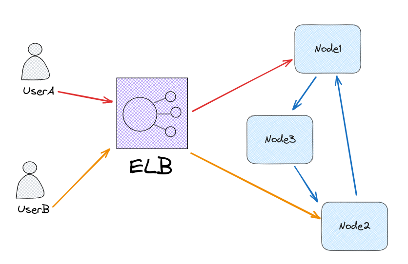
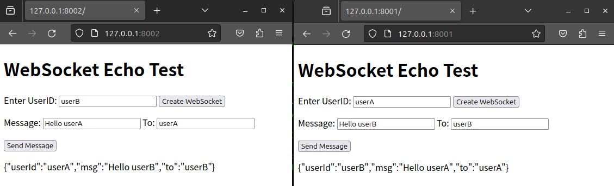

# Scaling WebSocket Demo

## TL;DR

使用`Consistent Hashing` 參考[groupcache](https://github.com/golang/groupcache) 在不同節點上儲存 User's Connection 資訊

- Consistent Hashing
- Service Discovery

下一步是實作 `Chore`

## 問題

如何知道 User's Connection 在哪個節點？

> 單就訊息通知也可以使用 pull model 或是 push pull 混合的方式。這裡主要想針對 push model 來討論

## 想法
- layer 7 load balancer
    - pattern hashing
    - 但在 tcp 連線上沒辦法這樣做,可能可以用認證訊息分配流量


- 儲存在其他服務上(?)
    - ~~etcd~~ (不要在節點儲存太多資料)
        - lease keepalive
    - Redis
        - [Redis pipelining](https://redis.io/docs/manual/pipelining/)
            > 週期性的將節點上所有的連線資訊寫入 Redis
    - Dynamodb
    - Cassandra
    - etc.
- 儲存在分散式節點
    - 詢問每個節點: O(n)
        - 並在節點上使用 LRU cache
    - 用類似 gossip 的方式，擴散詢問
    - 用類似 gossip 的方式,讓每個節點都知道所有節點的資訊
    - Consistent Hashing: O(1)
        - 如何處理節點的加入與離開？
         - 如果 service id 都是固定的，那麼節點短暫離開後，再加入，就沒有影響
    - Distributed Hash Table: O(log(n)) 
        - Chord
        - Pastry
        - Kademlia
        - etc.

## 實作



使用 Consistent Hashing 在不同節點上儲存 User's Connection 資訊

因為固定`userId`的資訊存在固定的節點(`userA`即使連上`Node1`,但資訊還是存在`Node2`),找到`userId`的資訊後,就可以直接連線到對應的節點

### 其他
- 沒有gRPC
- Consistent Hashing 沒有用 rbtree
- 沒有測試
- 沒有良好的命名或資料夾分類
    > 這是花了兩個半夜一邊聊天一邊寫的，所以有點混亂


## Demo





```bash
docker compose up
```

之後可以隨意訪問
- http://localhost:8001
- http://localhost:8002
- http://localhost:8003

使用一組`ID`傳送給任意`ID`
